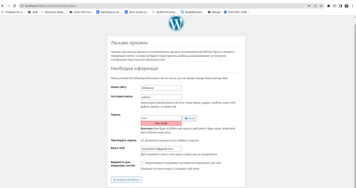
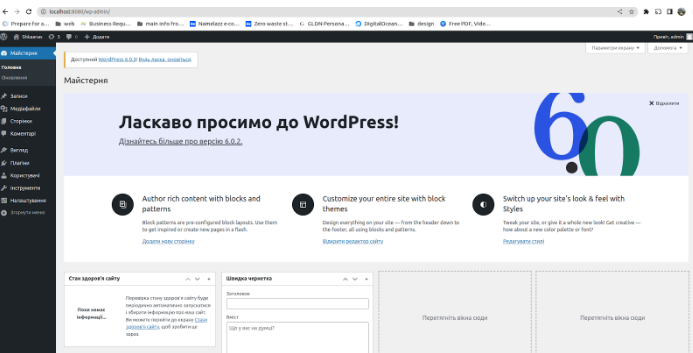
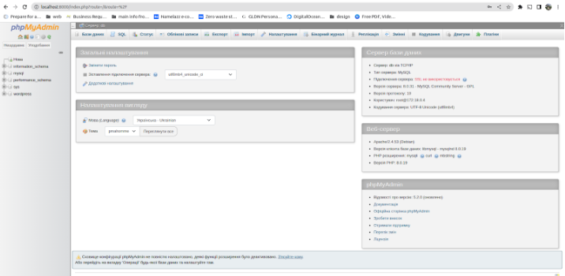
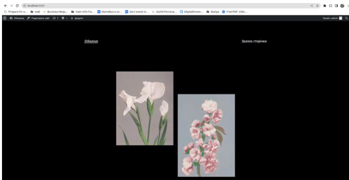
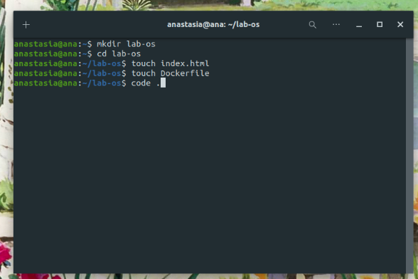
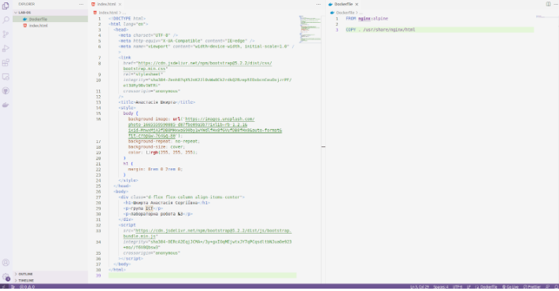
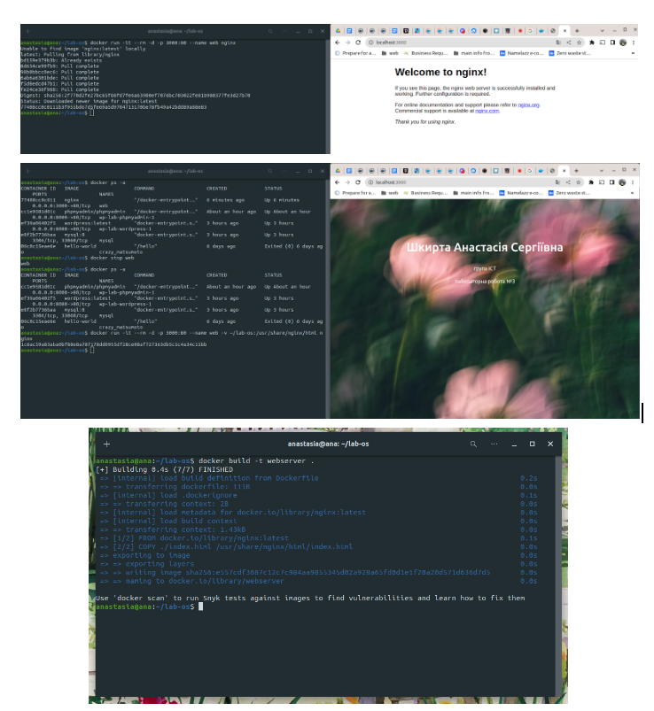
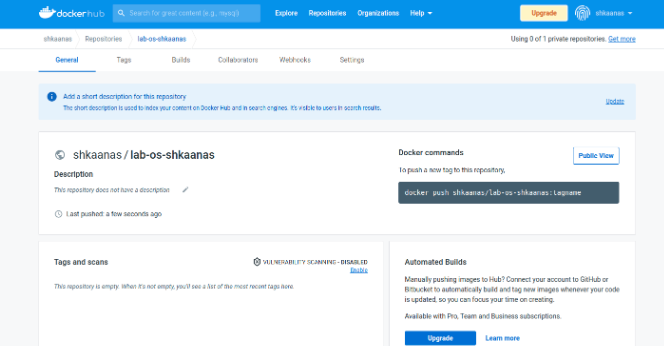
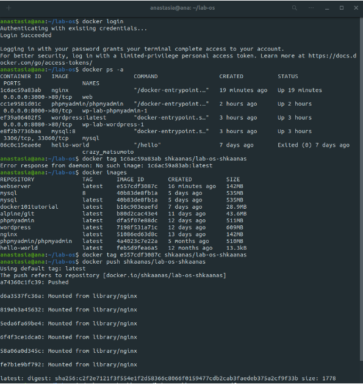

# Лабораторна робота №3

## **Docker**

1. **Використання готових Docker Images.**   файл .yml для wordpress docker image   завантажені docker image    виконання команди docker compose up      власний сайт на wordpress  
2. **Використання Docker Compose.** Docker Compose — це інструмент для запуску та створення багатоконтейнерної програми Docker. Він дозволяє керувати зображеннями з кількома контейнерами завдяки конфігурації YAML в якій все попередньо описано. І це дозволяє запускати та зупиняти контейнери одночасно, використовуючи одну команду. Docker Compose не створює зображення, натомість тут описано, як запустити образ Docker як контейнер. Переваги: має простий для розуміння синтаксис, надає кілька ізольованих середовищ на одному хості, дозволяє запускати змінні серед середовища, представляє набір команд для керування життєвим циклом програми.  приклад створення та збирання образа за допомогою Docker Compose  
3. **Створення HTML сторінки та занесення її в Docker Image. Залити даний Docker Image на Docker Hub.**      
4. **Скачати Docker Image когось із групи і розвернути в себе контейнер з HTML сторінкою на порті 8086 ззовні.** 
