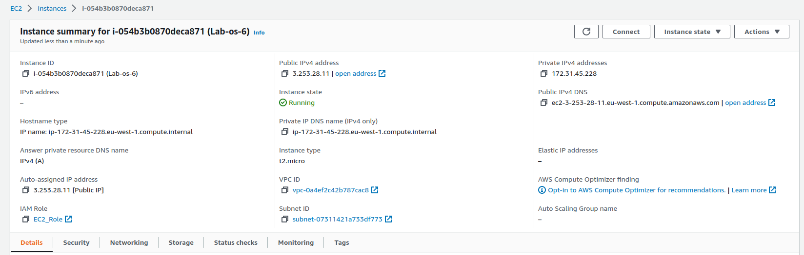
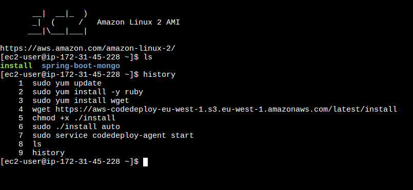
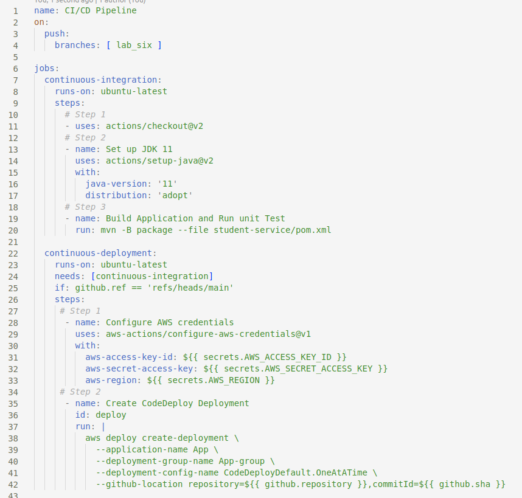
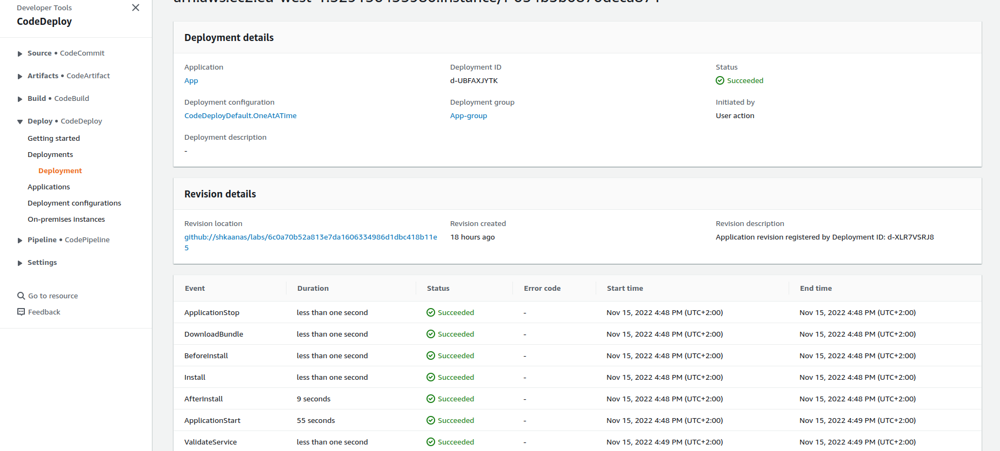
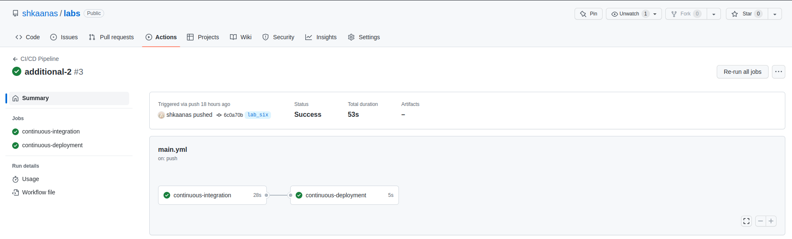

# Лабораторна робота №6

## **Використання GitHub Actions**

1. **Ознайомитись із поняттями CI/CD та GitHub Actions.** 
**CI/CD Pipeline** — це практика розробки. Ця практика вирішує питання
швидкого передавання якісних функцій у виробниче середовище.
Тобто прискорення процесу випуску доповнення без шкоди для якості.
 **CI/CD** — це радикальний відхід від ручного способу виконання завдань.
За допомогою CI/CD можна встановити механізм, який автоматично буде
запускати процеси збірки, тести.
Є різноманітні інструменти, які можна використовувати для автоматизації етапів збірки, тестування та розгортання в Pipeline CI/CD, наприклад CI Circle, Travis CI, Jenkins, GitHub Actions тощо. 
**GitHub Actions** — це платформа безперервної інтеграції та безперервної доставки (CI/CD), яка дозволяє автоматизувати збірку, тестування та розгортання. GitHub надає віртуальні машини Linux, Windows і macOS для запуску робочих процесів, або можна розмістити власні програми запуску у власному центрі обробки даних або хмарній інфраструктурі.
2. **Задеплоїти проект на EC2 або VPS(за наявності) за допомогою GitHub Actions.**
  
  
3. **Ознайомитись із github pipelines та використати їх для реалізації CI/CD.** 
GitHub Actions workflows є YAML файлом, що знаходиться в папці .github/workflows.  
  
  
  