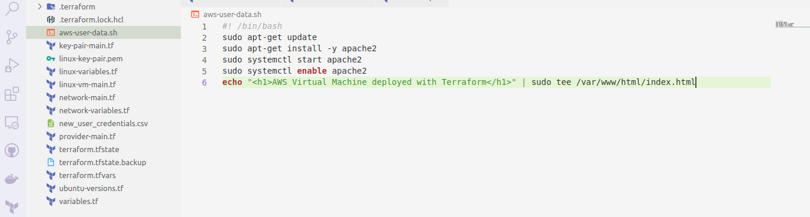
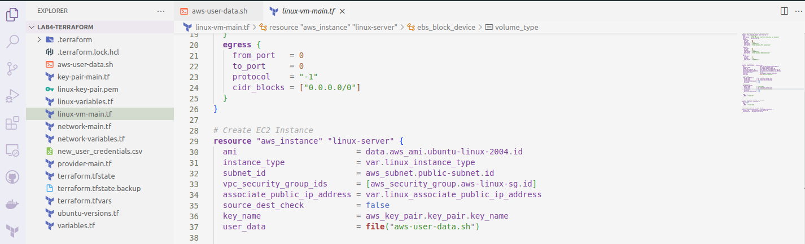
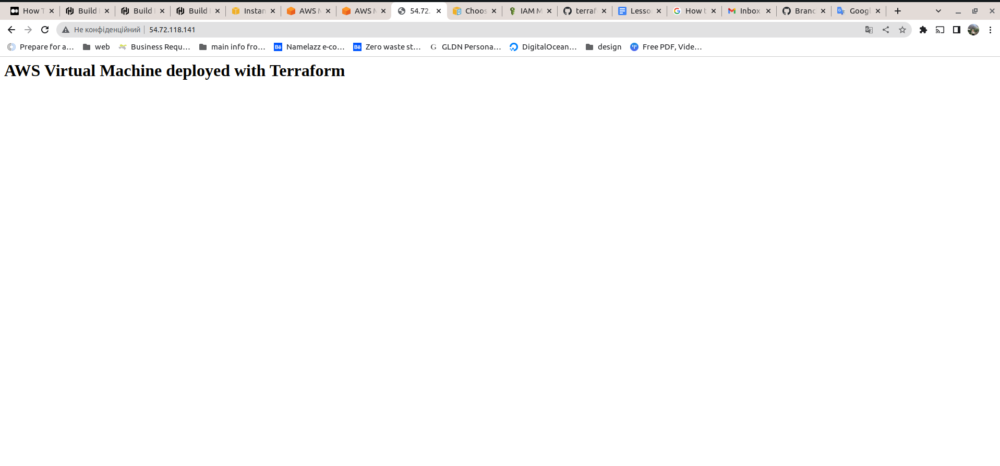

# Lab №4

## **Create terraform scenario for provisioning infrastructure on GCP (or AWS) cloud Requirement**

1. **Create one instance (image: ubuntu 20.04)**  
2. **Allow HTTP/HTTPS traffic on a NIC**
3. **Provision one SSH public key for created instance**
4. **Install Web Server (Apache HTTP Server / NGINX HTTP Server) via bash scenario**
   

