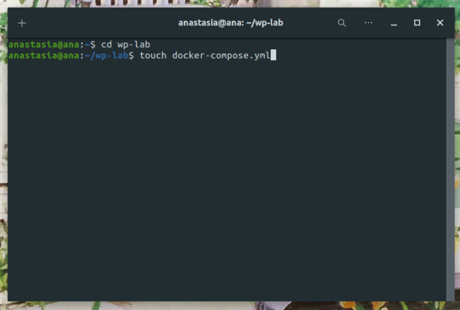
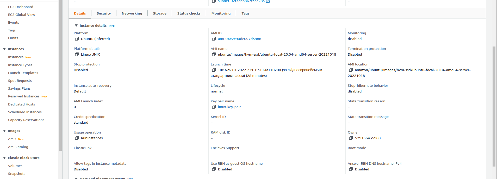
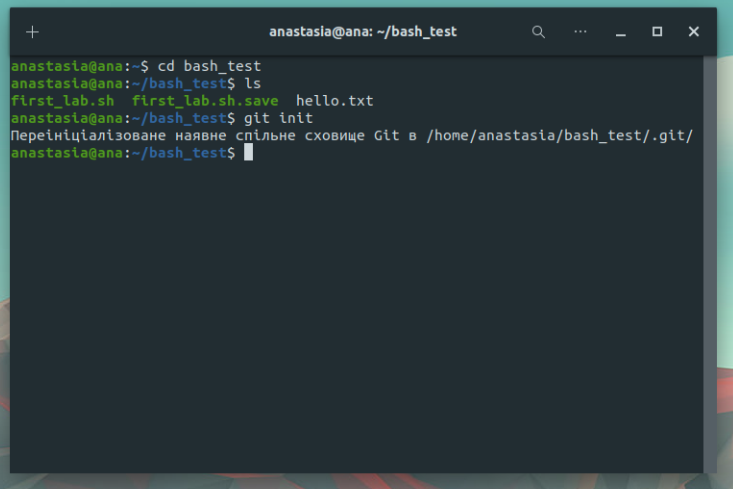

# Лабораторна робота №5

## **Деплой проекту на AWS EC2**

1. **Зареєструватись на AWS**  
2. **Створити інстанс EC2**  
3. **Задеплоїти проект (може бути  html сторінка) і скинути посилання в звіт для можливості перегляду**
