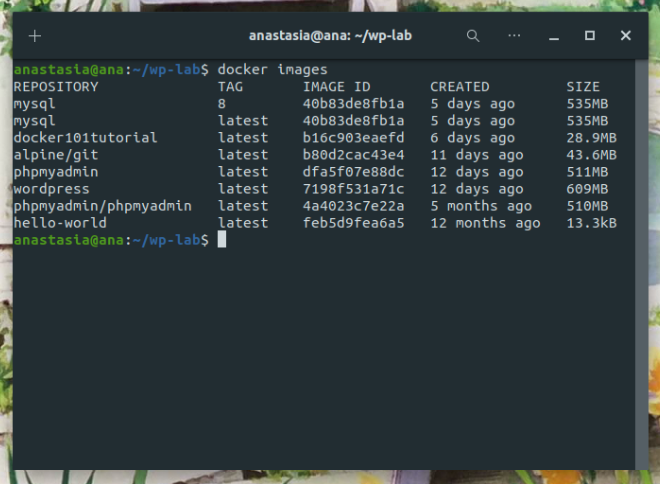
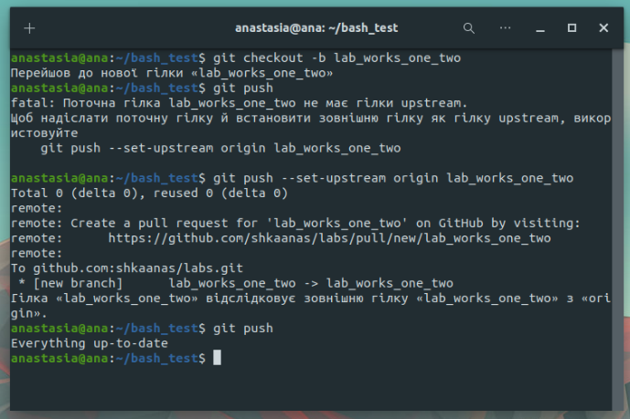
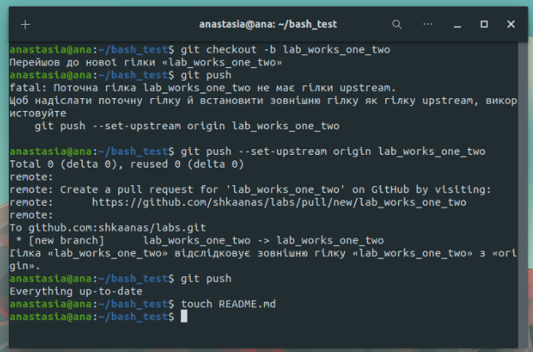

# Лабораторна робота №2

## **Основні команди системи контролю версій Git**

1. Пройти гру Git Learn та зробити скріншоти пройдених рівнів.  
2. Зробити git init папки із файлом  hello.txt та bash скриптом. 
3. Зробити git commit. 
4. Зробити git push у віддалений репозиторій у вітку lab_works_one_two. 
5. Додати в файл Readme звіт до лабораторної, щоб його можна було подивитися на репозиторію коли переходиш у вітку. 
